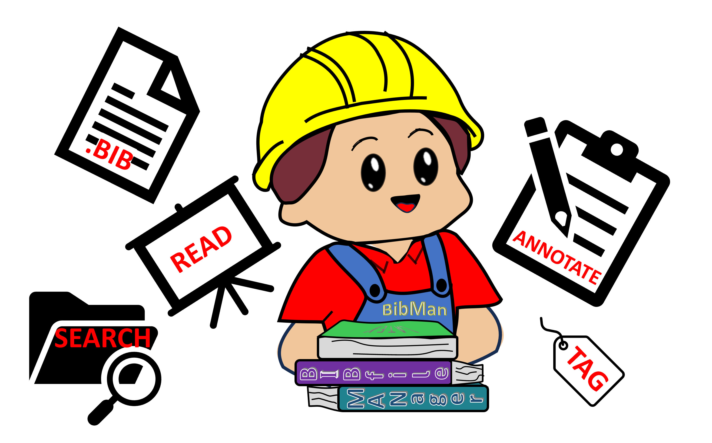

  

# BibMan: a reference manager for research groups

BibMan keeps your group's bibliography in one shared library and adds two things ordinary reference managers don't have:

- **Passage-level tagging.** Highlight a specific sentence or claim inside a paper and tag or annotate *that passage*, not just the paper as a whole.
- **Semantic and set-based search.** Find the right citation by meaning ("papers that measure the Schmidt law slope") and by combining tags and terms with AND/OR/NOT, shown as an overlap (Venn) view.

It exports standard `.bib` files and plugs directly into [gooTeX](https://github.com/pmarcum/gooTeX), which pulls your bibliography in at compile time.

There are three ways to read this repository:

| You are… | Read |
|---|---|
| A **user** in a group that already runs BibMan | This page |
| A group that wants to **run its own BibMan** | [DEPLOY.md](DEPLOY.md) |
| The person who **hosts** a BibMan server | [MAINTENANCE.md](MAINTENANCE.md) |

> Looking for the original Google Sheets version of BibMan (2021)? It is preserved, unmaintained, in [`legacy/sheets-version/`](legacy/sheets-version/).

---

## Getting access

BibMan has no sign-up page. Your group's BibMan administrator adds your Google account email to the group's access list and sends you the **dashboard link** (a `script.google.com/macros/s/…/exec` address). Open it while signed in to that Google account. The first time, Google asks you to authorize BibMan; accept, and the dashboard loads.

If you see **Access Denied**, the email you are signed in with is not on the list. Check which Google account is active (top-right of any Google page) or ask your administrator.

## Installing the "Add to BibMan" button

1. In the dashboard, open the **Utilities** tab and find **Bookmarklet**.
2. Drag the **Add to BibMan** button onto your browser's bookmarks bar. (Clicking it in the dashboard only shows a reminder; it has to be dragged.)

The button is personal to your group's BibMan, so get it from your own group's dashboard rather than copying one from someone in another group.

## Adding papers

While viewing a paper on NASA ADS, arXiv, or a journal's site, click **Add to BibMan** in your bookmarks bar. BibMan finds the paper's identifier (DOI, arXiv ID or ADS bibcode), pulls the bibliographic record from NASA ADS, reads the PDF, and splits it into passages you can tag and search. You can also add papers by hand or import an existing `.bib` file from the dashboard.

The BibMan server does not keep copies of PDFs. It records where each PDF lives and fetches it when you open the paper. (Your administrator can optionally have PDFs saved to a shared Google Drive folder as well.)

Word search covers a new paper as soon as it is added. Meaning-based search reaches it later, once the server has processed it.

## Tagging and annotating

Open a paper, select text in the PDF, and attach a note or tag to that passage. Papers and passages can also be marked as key points, pinned, or flagged for follow-up, and you can @-mention a teammate on a paper to point them to it.

## Searching

The search view combines several queries and shows how their results overlap. Each query matches the words themselves, related terms from the group's synonym list (astronomy jargon, spectral lines and ionization states are built in), and passages with a similar meaning even when the wording differs. Put a query in "quotes" to match that exact wording only.

## Getting your `.bib` file

Export the library (or a selection) as BibTeX from the dashboard. If your group uses gooTeX, you don't need to export anything: gooTeX asks BibMan for the entries your document cites each time it compiles.

## Updates

BibMan's interface updates itself. If an "update available" banner appears, it is a message for your administrator; there is nothing for you to install.
